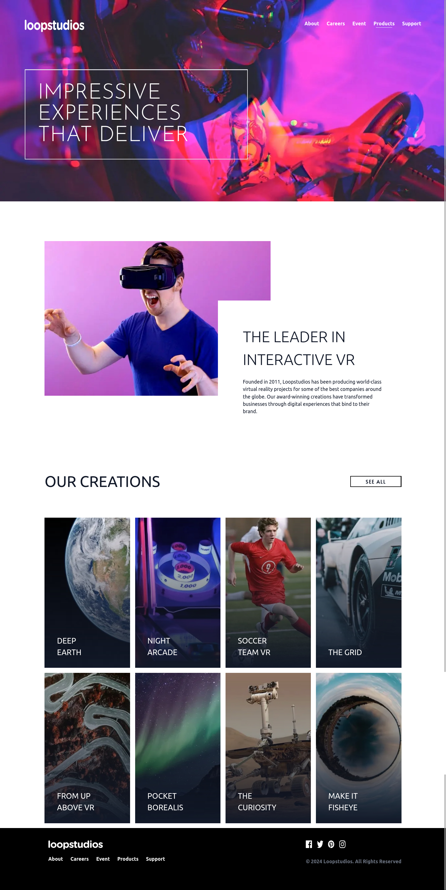

# Frontend Mentor - Loopstudios landing page solution

This is a solution to the [Loopstudios landing page challenge on Frontend Mentor](https://www.frontendmentor.io/challenges/loopstudios-landing-page-N88J5Onjw). Frontend Mentor challenges help you improve your coding skills by building realistic projects.

## Table of contents

- [Overview](#overview)
  - [The challenge](#the-challenge)
  - [Screenshot](#screenshot)
  - [Links](#links)
- [My process](#my-process)
  - [Built with](#built-with)
  - [What I learned](#what-i-learned)
  - [Continued development](#continued-development)
  - [Useful resources](#useful-resources)
- [Author](#author)
- [Acknowledgments](#acknowledgments)

## Overview

### The challenge

Users should be able to:

- View the optimal layout for the site depending on their device's screen size
- See hover states for all interactive elements on the page

### Screenshot

### Links

- Solution URL: [Add solution URL here](https://github.com/ttsoares/studiosLoop)
- Live Site URL: [Add live site URL here](https://studios-loop.vercel.app/)

## My process

### Built with

- Semantic HTML5 markup
- TailwindCSS Grid
- Desktop-first workflow
- [Next.js](https://nextjs.org/) - React framework
- [TailwindCSS](https://tailwindcss.com/) - For styles

### What I learned

Use two different typefaces configured via TailwindCSS.

### Continued development

The layout.js approach of NextJS impose some complications as the one in this page where the background image
in the Home must algo be below the Nav... My intuition is that there is a better way to solve it.

### Useful resources

- NextJS 14 - [Course from CodeEvolution](https://www.youtube.com/watch?v=ZjAqacIC_3c&list=PLC3y8-rFHvwjOKd6gdf4QtV1uYNiQnruI)

## Author

- Website - [Thomas Tschoepke Soares](https://buildesign.vercel.app/)
- Frontend Mentor - [@ttsoares](https://www.frontendmentor.io/profile/ttsoares)

## Acknowledgments

- [Env. variables](https://www.mohammadfaisal.dev/blog/how-to-handle-different-environments-in-a-nextjs-application) - Handling multiple environments is an essential part of any modern application. We don’t want to mix our secrets while developing and going to production.
